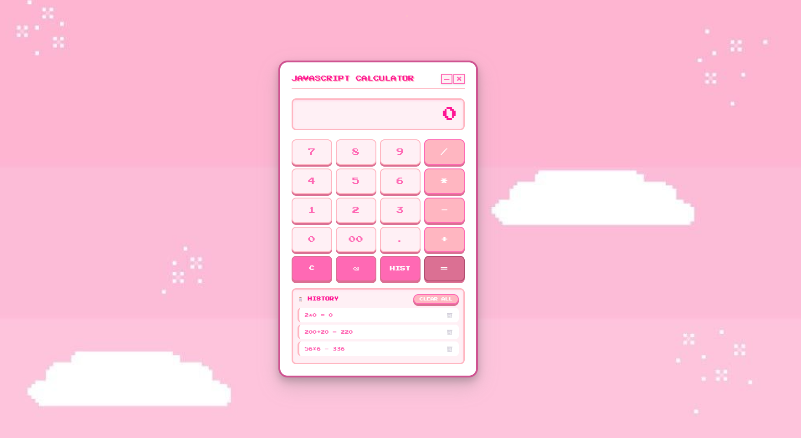

# Lab-Part-1-JavaScript-Calculator
A JavaScript program that simulates a calculator capable of performing basic operations and keeping track of all calculations made.

## [🚀 View Live Demo](https://github.com/ToniMoringa/Lab-Part-1-JavaScript-Calculator)